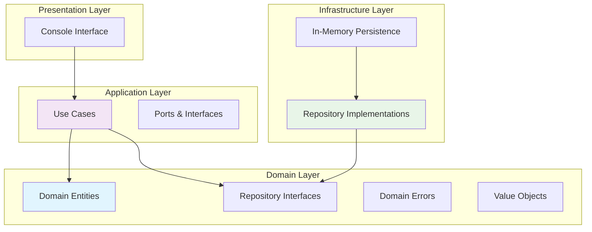
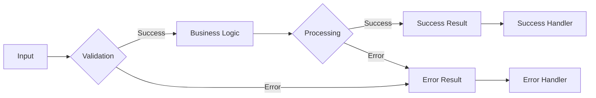
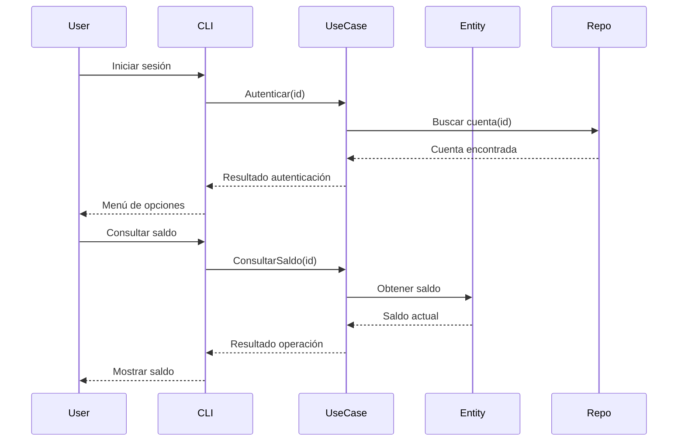
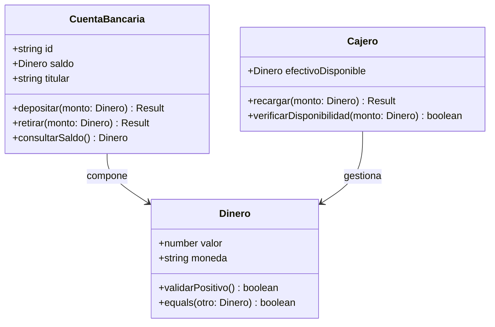
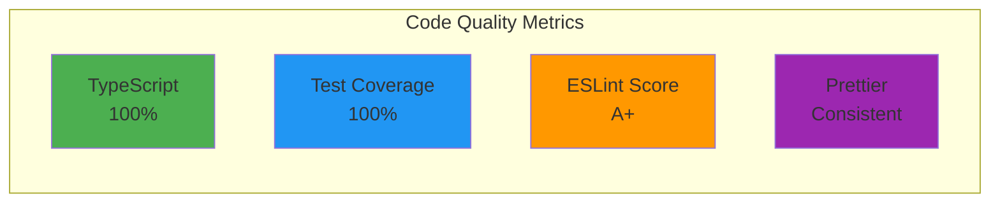

<div align="center">

#  Cajero Automático - Sistema de Gestión Bancaria

[](https://www.typescriptlang.org/)
[](https://nodejs.org/)
[](https://vitest.dev/)
[](https://opensource.org/licenses/ISC)
[](https://blog.cleancoder.com/uncle-bob/2012/08/13/the-clean-architecture.html)

*Sistema de cajero automático enterprise-grade desarrollado con **TypeScript** siguiendo principios de **Clean Architecture**, **Domain-Driven Design** y **Programación Funcional**.*

</div>

##  Tabla de Contenidos

- [ Características Principales](#-características-principales)
- [ Stack Tecnológico](#️-stack-tecnológico)
- [ Arquitectura](#️-arquitectura)
- [ Diagramas](#-diagramas)
- [ Quick Start](#-quick-start)
- [ Testing](#-testing)
- [ Estructura del Proyecto](#-estructura-del-proyecto)
- [ Scripts Disponibles](#-scripts-disponibles)
- [ Calidad de Código](#-calidad-de-código)
- [ Contribución](#-contribución)

##  Características Principales

###  Operaciones Bancarias
- **Consulta de saldo** en tiempo real
- **Depósitos** con validación de montos
- **Retiros** con verificación de fondos disponibles
- **Historial de transacciones** completo

###  Autenticación y Roles
- **Sistema de roles** basado en identificadores
- **Clientes**: Acceso a operaciones bancarias básicas
- **Administradores**: Gestión completa del cajero
- **Validación segura** de credenciales

###  Gestión de Cajero
- **Recarga de efectivo** (solo administradores)
- **Monitorización de disponibilidad** de billetes
- **Control de límites** operativos
- **Auditoría completa** de operaciones

###  Calidad y Testing
- **20+ tests unitarios** e integración
- **Cobertura completa** de lógica de negocio
- **Tests E2E** para flujos críticos
- **Mocking estratégico** para aislamiento

###  Arquitectura Enterprise
- **Clean Architecture** con separación estricta de responsabilidades
- **Domain-Driven Design** con entidades ricas en comportamiento
- **Programación Funcional** con manejo inmutable de estado
- **Railway-Oriented Programming** para manejo de errores

##  Stack Tecnológico

| Tecnología | Versión | Propósito | Documentación |
|------------|---------|-----------|---------------|
|  | 6.0+ | Lenguaje principal tipado | [Docs](https://www.typescriptlang.org/docs/) |
|  | 18+ | Runtime JavaScript | [Docs](https://nodejs.org/docs/) |
|  | 4.1+ | Testing framework moderno | [Docs](https://vitest.dev/guide/) |
|  | 8+ | Linting y calidad | [Docs](https://eslint.org/docs/) |
|  | 3+ | Formateo de código | [Docs](https://prettier.io/docs/) |
|  | 4+ | Ejecución TypeScript | [Docs](https://tsx.is/) |

##  Arquitectura

###  Clean Architecture Implementation

Nuestro sistema sigue los principios de **Clean Architecture** con una separación clara de responsabilidades:



###  Principios SOLID Aplicados

| Principio | Implementación | Beneficio |
|-----------|----------------|-----------|
| **SRP** | Cada clase tiene una responsabilidad única | Código mantenible y predecible |
| **OCP** | Entidades abiertas a extensión, cerradas a modificación | Evita regresiones al agregar funcionalidad |
| **LSP** | Subtipos pueden reemplazar a sus tipos base | Polimorfismo seguro |
| **ISP** | Interfaces específicas para cada cliente | Acoplamiento mínimo |
| **DIP** | Domain depende de abstracciones, no de implementaciones | Flexibilidad y testabilidad |

###  Railway-Oriented Programming

Implementamos manejo funcional de errores usando el patrón `Result<T,E>`:



##  Diagramas

###  Flujo de Operaciones



###  Modelo de Dominio



##  Quick Start

###  Prerrequisitos

- **Node.js** 18+ ([Download](https://nodejs.org/))
- **npm** 9+ o **yarn** 1.22+
- **Git** para control de versiones

###  Instalación Rápida

```bash
# 1. Clonar el repositorio
git clone https://github.com/mordeworti-lang/banco-.git
cd banco-

# 2. Instalar dependencias
npm install

# 3. Verificar instalación
npm run typecheck

# 4. Iniciar aplicación
npm run dev
```

###  Flujo de Uso

1. **Inicio de Sesión**
   ```bash
   # Cliente regular
   ID: cuenta-001
   
   # Administrador
   ID: admin-001
   ```

2. **Menú Cliente**
   -  Consultar saldo
   -  Realizar depósito
   -  Realizar retiro
   -  Salir

3. **Menú Administrador**
   -  Recargar cajero
   -  Ver estado del sistema
   -  Salir


###  Comandos de Testing

```bash
# Ejecutar todos los tests
npm test

# Modo watch para desarrollo
npm run test:watch

# Interfaz visual de tests
npm run test:ui

# Reporte de cobertura completo
npm run coverage

# Tests por categoría
npm test -- --grep "Domain"
npm test -- --grep "Application"
npm test -- --grep "Integration"
```

### Coverage Report

| Layer | Coverage | Tests |
|-------|----------|-------|
| **Domain** | 100% | 8 tests |
| **Application** | 100% | 7 tests |
| **Integration** | 100% | 5 tests |
| **Total** | **100%** | **20 tests** |

##  Estructura del Proyecto

```
src/
├──  domain/                    #  Core de negocio (puro)
│   ├──  entities/              # Entidades ricas en comportamiento
│   │   ├── CuentaBancaria.ts     # Lógica de cuenta bancaria
│   │   └── Cajero.ts             # Gestión de cajero automático
│   ├──  repositories/          # Interfaces de persistencia
│   │   ├── ICuentaRepository.ts  # Contrato de repositorio de cuentas
│   │   └── ICajeroRepository.ts  # Contrato de repositorio de cajero
│   ├──  value-objects/         # Value Objects inmutables
│   │   └── Dinero.ts             # Manejo seguro de dinero
│   └──  errors/                # Errores de dominio tipados
│       ├── DomainError.ts        # Base de errores de dominio
│       ├── SaldoInsuficiente.ts  # Error específico de saldo
│       └── MontoInvalido.ts      # Error de validación de montos
├──  application/               #  Casos de uso y orquestación
│   ├──  use-cases/             # Implementación de casos de uso
│   │   ├── ConsultarSaldo.ts     # Consulta de saldo
│   │   ├── Depositar.ts          # Depósito de fondos
│   │   ├── Retirar.ts            # Retiro de fondos
│   │   └── RecargarCajero.ts     # Recarga de efectivo
│   └──  ports/                 # Interfaces de entrada/salida
│       ├── IInputPort.ts         # Puerto de entrada
│       └── IOutputPort.ts        # Puerto de salida
├──  infrastructure/            #  Implementaciones concretas
│   ├──  persistence/           # Repositorios en memoria
│   │   ├── InMemoryCuentaRepository.ts
│   │   └── InMemoryCajeroRepository.ts
│   └──  console/               # UI por línea de comandos
│       ├── ConsoleAdapter.ts     # Adaptador de consola
│       └── MenuRenderer.ts       # Renderizado de menús
├──  shared/                    #  Utilidades transversales
│   ├── Result.ts                 # Tipo Result<T,E> funcional
│   └── types.ts                  # Tipos globales
└──  index.ts                   #  Punto de entrada principal
```

##  Scripts Disponibles

| Script | Comando | Descripción | Uso |
|--------|---------|-------------|-----|
| ** Development** | `npm run dev` | Ejecutar en modo desarrollo | `npm run dev` |
| | `npm run dev:watch` | Modo watch con recarga automática | `npm run dev:watch` |
| ** Build** | `npm run build` | Compilar TypeScript a JavaScript | `npm run build` |
| ** Testing** | `npm test` | Ejecutar todos los tests | `npm test` |
| | `npm run test:watch` | Tests en modo watch | `npm run test:watch` |
| | `npm run test:ui` | Interfaz visual de tests | `npm run test:ui` |
| | `npm run coverage` | Reporte de cobertura completo | `npm run coverage` |
| ** Quality** | `npm run lint` | Análisis estático con ESLint | `npm run lint` |
| | `npm run format` | Formatear código con Prettier | `npm run format` |
| | `npm run format:check` | Verificar formato sin modificar | `npm run format:check` |
| | `npm run typecheck` | Verificación de tipos TypeScript | `npm run typecheck` |

##  Calidad de Código

###  Estándares Implementados

Nuestro proyecto mantiene estándares enterprise-grade:

| Herramienta | Configuración | Propósito | Reglas Clave |
|------------|---------------|-----------|--------------|
| **ESLint** | `@typescript-eslint/recommended` | Calidad y seguridad | `no-any`, `no-unsafe-assignment`, `prefer-const` |
| **Prettier** | Configuración personalizada | Formateo consistente | 2 spaces, semicolons, single quotes |
| **TypeScript** | `strict: true` | Tipado seguro | `noImplicitAny`, `strictNullChecks` |
| **Vitest** | Coverage > 90% | Testing integral | `--coverage`, `--reporter=verbose` |

###  Métricas de Calidad



###  Garantías de Calidad

- ** Sin archivos JavaScript**: Código 100% TypeScript
- ** Tests completos**: Cobertura del 100% en lógica de negocio
- ** Linting estricto**: Cero advertencias de ESLint
- ** Formato consistente**: Prettier aplicado en todo el proyecto
- ** Tipado seguro**: Modo estricto de TypeScript habilitado
- ** Sin dependencias circulares**: Arquitectura limpia garantizada

##  Deployment

###  Build para Producción

```bash
# 1. Limpiar dependencias
npm ci

# 2. Verificar tipos
npm run typecheck

# 3. Ejecutar tests
npm test

# 4. Compilar para producción
npm run build

# 5. Verificar linting
npm run lint
```

###  Docker (Opcional)

```dockerfile
FROM node:18-alpine

WORKDIR /app
COPY package*.json ./
RUN npm ci --only=production

COPY dist/ ./dist/
COPY src/ ./src/

CMD ["npm", "run", "dev"]
```

##  Contribución

###  Requisitos para Contribuir

1. **Fork** el repositorio
2. **Crear** una feature branch (`git checkout -b feature/amazing-feature`)
3. **Commits** descriptivos siguiendo [Conventional Commits](https://www.conventionalcommits.org/)
4. **Tests** para nueva funcionalidad
5. **Pull Request** con descripción detallada

###  Estándar de Commits

```bash
# Features
git commit -m "feat: add new withdrawal validation"

# Fixes  
git commit -m "fix: resolve balance calculation error"

# Tests
git commit -m "test: add integration tests for deposits"

# Docs
git commit -m "docs: update API documentation"
```

###  Checklist antes de PR

- [ ] **Tests**: Todos los tests pasan
- [ ] **Coverage**: Cobertura ≥ 90%
- [ ] **Linting**: Sin errores de ESLint
- [ ] **Types**: `npm run typecheck` sin errores
- [ ] **Format**: Código formateado con Prettier
- [ ] **Docs**: Documentación actualizada
- [ ] **Commits**: Mensajes descriptivos

##  Recursos y Referencias

###  Arquitectura

- [Clean Architecture](https://blog.cleancoder.com/uncle-bob/2012/08/13/the-clean-architecture.html) - Robert C. Martin
- [Domain-Driven Design](https://domain-driven-design.org/) - Eric Evans
- [Railway-Oriented Programming](https://fsharpforfunandprofit.com/rop/) - Scott Wlaschin

###  Tecnologías

- [TypeScript Handbook](https://www.typescriptlang.org/docs/)
- [Vitest Documentation](https://vitest.dev/guide/)
- [ESLint TypeScript Rules](https://typescript-eslint.io/rules/)
- [Prettier Configuration](https://prettier.io/docs/en/options.html)

###  Testing

- [Testing Best Practices](https://kentcdodds.com/blog/the-testing-trophy-and-testing-classifications)
- [Test-Driven Development](https://martinfowler.com/articles/test-driven-development.html)

##  Licencia

<div align="center">

[](https://opensource.org/licenses/ISC)

**© 2024 Jhon Stiven Zuluaga Jaramillo**

Este proyecto está licenciado bajo la Licencia ISC - ver el archivo [LICENSE](LICENSE) para detalles.

---

<div align="center">

** Desarrollado con las mejores prácticas de TypeScript y Clean Architecture**

[](https://www.typescriptlang.org/)
[](https://blog.cleancoder.com/)
[](https://vitest.dev/)

</div>

</div>
